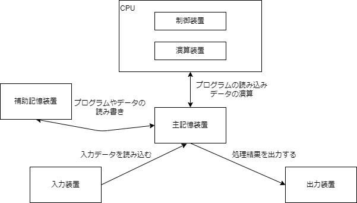

# 2022/6/20 勉強会資料

---

# 内容
+ 事前：VirtualBoxの環境構築
+ コンピュータ５大装置
+ LinuxコマンドでCPUやメモリ使用量を確認
+ プログラムでスワップを発生させてみる
+ 2進数、10進数、16進数
+ 文字コードについて
+ Javaプログラムでファイル読み込み
+ WindowsとUNIXにおける開発時の注意点

---

# 事前：VirtualBoxの環境構築する

※詳しい手順は別資料にまとめてます。

+ VirtualBox
[https://www.oracle.com/jp/virtualization/technologies/vm/downloads/virtualbox-downloads.html]()

+ AlmaLinux OS
[https://almalinux.org/ja/]()  
今回は「AlmaLinux-8.6-x86_64-minimal.iso」をダウンロード

+ Teraterm(Windowsの場合)
[https://ja.osdn.net/projects/ttssh2/releases/]()

---

コンピュータの五大装置には何があるの？

---

# コンピュータの五大装置

+ CPU（Central Processing Unit）
+ 主記憶装置
+ 補助記憶装置
+ 入力装置
+ 出力装置

---

# CPU（Central Processing Unit）
+ コンピュータ全体の制御、四則演算をはじめとする演算を行う。
+ CPU製造メーカー
    + PC向け：Intel、AMD
    + モバイル向け：Qualcomm、SAMSUNG等

---

# 主記憶装置
+ コンピュータが動作するためのプログラムやデータを一時的に保持する装置。
+ RAM：電源を切ると保持した内容が消える。
+ ROM：電源を切っても保持した内容が消えない。
+ 最近の一般的なPCに搭載されているのは「DDR4 SDRAM」というRAMの一種。
+ みんなメモリって言うことが多いと思う。

# 補助記憶装置
+ プログラムやデータを長期的に保持する装置。
+ 電源を切っても保持した内容が消えない。
+ HHD(ハードディスクドライブ)、SSD(ソリッドステートドライブ)、CD-ROM、DVD-ROM

---

# 入力装置
+ コンピュータにデータを入力するための装置。
+ キーボード、マウス、スキャナ等

# 出力装置
+ コンピュータのデータを出力するための装置。
+ ディスプレイ、プリンタ等

---

# 5大装置の流れ

  

---

# クロック周波数
+ CPUが動作するときに基準信号の周波数。
+ 単位はHz(ヘルツ)。1Hzは1秒間の周波数が1ということ。
+ クロック周波数が大きいほど性能が高いCPUである。

# マルチプロセッサ
+ 1つのCPUの性能向上には限界が近づいている。
+ 複数のCPUで並列処理させて処理を分散させることで性能向上させる。
+ 複数のプロセッサコアを持ったCPUをマルチコアプロセッサ。
+ 2：デュアルコア、4：クアッドコア、8：オクタコア
+ 例えば[Intel Core i7 12700](https://www.dospara.co.jp/5shopping/detail_parts.php?bg=1&br=11&sbr=1328&mkr=2&ic=477498&lf=0)。

---

# 実際にCPUやメモリの使用率を見てみよう

---

# スワッピング(スワップ)
+ 主記憶装置と補助記憶装置の内容を入れ替えること。
+ 優先度の高いプログラムを実行したいときに、主記憶装置の容量が足りない場合、優先度の低いプログラムの主記憶領域を補助記憶装置に退避させる。(スワップアウト)
+ 退避させたプログラムに実行権が戻った場合に、退避した内容を補助記憶装置から再び主記憶装置に読み込ませる。(スワップイン)
+ 主記憶装置の代用として補助記憶装置を使うことになるが、主記憶装置に比べ補助記憶装置は読み書きが低速であるため、処理速度が低下する。

---

# スワップを発生させてみよう

---

# 10進数、2進数、8進数、16進数

<section>

| 10進数 | 2進数 | 8進数 | 16進数 |
| --- | --- | --- | --- |
| 0 | 0| 0 | 0 |
| 1 | 1 | 1 | 1 |
| 2 | 10 | 2 | 2 |
| 3 | 11 | 3 | 3 |
| 4 | 100 | 4 | 4 |
| 5 | 101 | 5 | 5 |
| 6 | 110 | 6 | 6 |
| 7 | 111 | 7 | 7 |
| 8 | 1000 | 8 | 8 |

| 10進数 | 2進数 | 8進数 | 16進数 |
| --- | --- | --- | --- |
| 9 | 1001 | 10 | 9 |
| 10 | 1010 | 11 | A |
| 11 | 1011 | 12 | B |
| 12 | 1100 | 13 | C |
| 13 | 1101 | 14 | D |
| 14 | 1110 | 15 | E |
| 15 | 1111 | 16 | F |
| 16 | 10000 | 17 | 10 |
| 17 | 10001 | 18 | 11 |

</section>

---

+ コンピュータにおける情報の最小単位はビット(bit)で2進数。
+ よく使われる単位にバイト(byte)があるが、1バイト = 8ビットである。
+ バイトをあらわす数としては16進数がよく使われます。（例：文字コード等）
+ Javaの基本データ型（※8ビット「00000000～11111111」までが256通り）
    | データ型 | ビット | バイト | 範囲 |
    | - | - | - | - |
    | byte | 8ビット | 1バイト |  -128 ~ 127 | 
    | short | 16ビット | 2バイト | -32,768 ~ 32,767 | 
    | int | 32ビット | 4バイト | -2,147,483,648 ~ 2,147,483,647 | 
    | long | 64ビット | 8バイト | -9,223,372,036,854,775,808 ~ 9,223,372,036,854,775,807 | 

---

# 文字コード
+ コンピュータは文字を数値として割り当てることで、文字を表現している。
+ どのような文字をどの数値に割り当てるかは文字コードで決まる。

---

# 文字コードの種類

---

### ASCII
+ アルファベット、数字、いくつかの記号のみ。
+ 1文字7ビット。
+ 日本語ない。
+ コード表：https://www.k-cube.co.jp/wakaba/server/ascii_code.html

### Shift-JIS
+ ASCIIコードに日本語加えた文字コード。
+ 1文字1バイトと2バイトの組み合わせ。
+ 割り当てていない文字コード領域「外字領域」があり、独自に文字の拡張ができる。
+ WindowsもShift-JISを拡張したMS932を使っていたりする。
+ コード表：http://charset.7jp.net/sjis.html

---

### Unicode
+ 全世界の文字を1つのコード体系にしたもの。
+ 当初は1文字あたり2バイトだったが、3バイト、4バイトと拡張されている。
+ コード表：https://ja.wikipedia.org/wiki/Unicode%E4%B8%80%E8%A6%A7_0000-0FFF

### UTF-8
+ Unicodeの1文字を1～4バイトで表現する可変長符号化方式。
+ 例えばASCIIに含まれている文字は1バイト。「あ」のような平仮名は3バイトで表現される。
+ コード表：https://seiai.ed.jp/sys/text/java/utf8table.html

---

# Javaでファイルの読み書き、文字コードの違いで文字化けするか見てみる

1. [CharEncoding.java](./program/CharEncoding.java)と[sample.txt](./program/sample.txt)をローカルに配置。
1. コマンドプロントやターミナルでコンパイル。`javac CharEncoding.java`
1. 実行してみる。`java CharEncoding {文字コード} {sample.txtのファイルパス}`
  文字コード：`SJIS` or `UTF-8`

---

# WindowsとUnix系環境の開発時の注意点

### 改行
+ Windowsのデフォルト改行は「CRLF」に対して、Unix系OSは「LF」。
+ 開発環境はWindowsで、テスト環境や本番環境がUnix系OSの場合は作成したファイルの改行コードを気にしなければならない。
+ CRLF：ASCIIのCR(0x0D)とLF(0x0A)を並べたもの。

---

### パス
+ Windows
  + 例：`C:\Program Files\MySQL`
  + 最上位をドライブ名(C:)としてバックスラッシュで区切る。
+ Unix系
  + 例：`/var/logs`
  + 最上位をスラッシュ(/)としてスラッシュで区切る。
+ パスをプログラムに書いたとき、Windows環境で動いてたものがUnix環境で動かないことも。

---

# 改行やパスに気を付けたJavaプログラムの書き方

+ 改行には、`System.lineSeparator()`を使おう。
+ 

---

# 本日の内容は勉強会は以上です。