# 2022/6/21 Spring 勉強会

# フレームワークについて
共通的に必要な機能や、その雛形を提供するアプリケーション。
+ MVC（Model View Controller）のひな形
+ バッチ雛形
+ バリデーション（Validation）
+ 多言語化
+ セキュリティ

# Javaフレームワークの種類
+ Spring
+ JakartaEE（JavaEE）
+ Struts1, 2
+ Seasar2

# Springについて
+ Javaのオープンソースフレームワーク。
+ 起源はRod Johnsonの蔵書「Expert One-on-One: J2EE Design and Development」。
+ MVC（Model View Controller）、セキュリティ、データアクセス、バッチ、システム間連携など様々なフレームワークがある。

# Springの様々なプロジェクト（一部）

### Spring Framework
+ DI、トランザクション管理、WEBアプリケーション、データアクセス、メッセージング等のコア機能を提供する。

### Spring Data
+ データアクセステクノロジー、リレーショナルおよび非リレーショナルデータベース等を一貫したSpringベースのプログラミングモデルとして提供。

### Spring Security
+ 認証と認可の両方に焦点をあてた機能を提供するアクセス制御フレームワーク。

### Spring Batch
+ ロギング、トレース、トランザクション管理、ジョブ処理統計、ジョブの再起動、スキップ、リソース管理など、バッチ処理に不可欠な再利用可能な機能を提供。

### Spring Boot
+ Springベースアプリケーションを簡単に作成するための仕組み。
+ Tomcat、Jetty、Undertow を直接組み込むことでWarのデプロイが不要。
+ スターターによるビルド構成の簡素化。
+ Springとサードパーティーライブラリを自動的に構成（AutoConfigure）
+ メトリクス、ヘルスチェック、外部化された構成など本番環境に対応する機能。

___今回はSpringBootとSpringFrameworkを使って、コア機能を中心に実装の体験と理解を進める。___

# SpringのDIコンテナ
+ BeanはSpringのDIコンテナが管理するオブジェクトのこと。
+ DIコンテナはBeanの依存性を解決しながらインスタンスを生成する。
必要に応じてBeanを取り出して使う
+ `org.springframework.context.ApplicationContext`インタフェースがDIコンテナの役割を担当する。
+ spring-boot-starter-webの場合`org.springframework.boot.web.servlet.context.AnnotationConfigServletWebServerApplicationContext`が実装クラス。

# BeanとDIコンテナについて

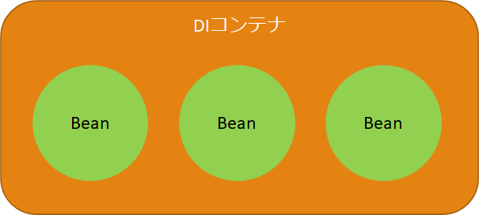  

# Spring Initializrでプロジェクトを作成する

+ ブラウザからの場合は[https://start.spring.io/]()からSpringベースのプロジェクトが作成できる。  
+ 今回はEclipseでSTSプラグインを使ってプロジェクトを作成する。
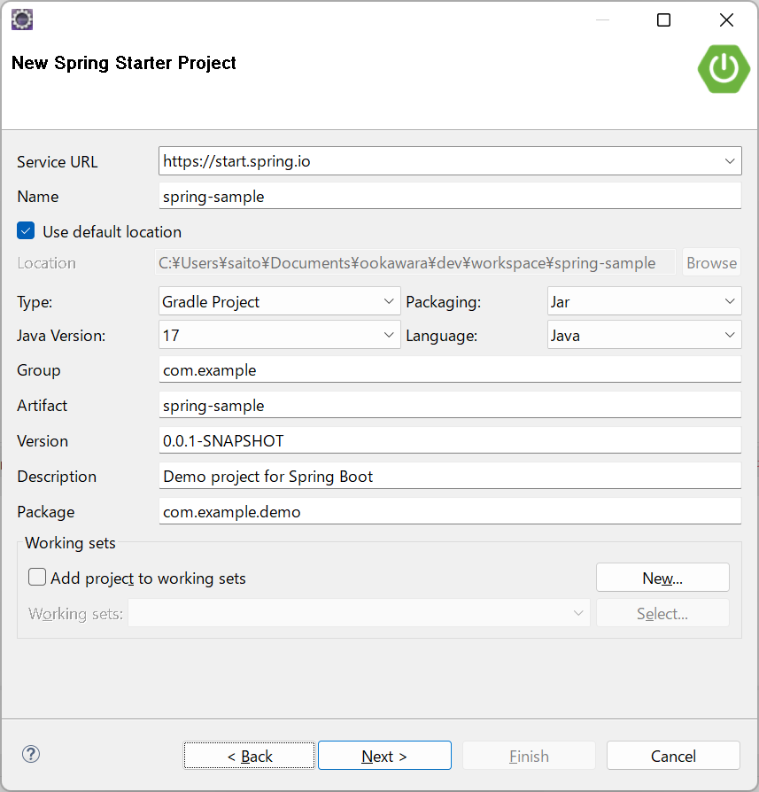  
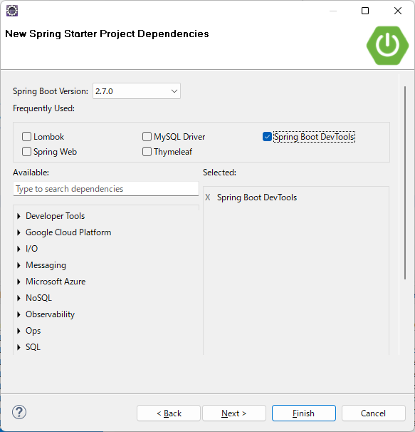  


### build.gradle
作成された`build.gradle`は次の通り。
```groovy
plugins {
	id 'org.springframework.boot' version '2.7.0'
	id 'io.spring.dependency-management' version '1.0.11.RELEASE'
	id 'java'
}

group = 'com.example'
version = '0.0.1-SNAPSHOT'
sourceCompatibility = '17'

repositories {
	mavenCentral()
}

dependencies {
	implementation 'org.springframework.boot:spring-boot-starter'
    developmentOnly 'org.springframework.boot:spring-boot-devtools'
	testImplementation 'org.springframework.boot:spring-boot-starter-test'
}

tasks.named('test') {
	useJUnitPlatform()
}
```

# Bean名を出力する
生成されたBeanの名前を出力する。
`SpringSampleApplication`に以下のメソッドを追加する。
```java
@Bean
public CommandLineRunner commandLineRunner
(ApplicationContext ctx) {
    return args -> {
        System.out.println("Let's inspect the beans provided by Spring Boot:");
        String[] beanNames = ctx.getBeanDefinitionNames();
        Arrays.sort(beanNames);
        for (String beanName : beanNames) {
            System.out.println(beanName);
        }
    };
}
```
コンソールには以下の通りBean名が出力される。
```
Let's inspect the beans provided by Spring Boot:
applicationAvailability
applicationTaskExecutor
commandLineRunner
forceAutoProxyCreatorToUseClassProxying
lifecycleProcessor
mbeanExporter
mbeanServer
objectNamingStrategy
org.springframework.aop.config.internalAutoProxyCreator
org.springframework.boot.autoconfigure.AutoConfigurationPackages
org.springframework.boot.autoconfigure.admin.SpringApplicationAdminJmxAutoConfiguration
org.springframework.boot.autoconfigure.aop.AopAutoConfiguration
org.springframework.boot.autoconfigure.aop.AopAutoConfiguration$ClassProxyingConfiguration
org.springframework.boot.autoconfigure.availability.ApplicationAvailabilityAutoConfiguration
org.springframework.boot.autoconfigure.context.ConfigurationPropertiesAutoConfiguration
org.springframework.boot.autoconfigure.context.LifecycleAutoConfiguration
org.springframework.boot.autoconfigure.context.PropertyPlaceholderAutoConfiguration
org.springframework.boot.autoconfigure.info.ProjectInfoAutoConfiguration
org.springframework.boot.autoconfigure.internalCachingMetadataReaderFactory
org.springframework.boot.autoconfigure.jmx.JmxAutoConfiguration
org.springframework.boot.autoconfigure.sql.init.SqlInitializationAutoConfiguration
org.springframework.boot.autoconfigure.task.TaskExecutionAutoConfiguration
org.springframework.boot.autoconfigure.task.TaskSchedulingAutoConfiguration
org.springframework.boot.context.internalConfigurationPropertiesBinder
org.springframework.boot.context.internalConfigurationPropertiesBinderFactory
org.springframework.boot.context.properties.BoundConfigurationProperties
org.springframework.boot.context.properties.ConfigurationPropertiesBindingPostProcessor
org.springframework.boot.context.properties.EnableConfigurationPropertiesRegistrar.methodValidationExcludeFilter
org.springframework.boot.sql.init.dependency.DatabaseInitializationDependencyConfigurer$DependsOnDatabaseInitializationPostProcessor
org.springframework.context.annotation.internalAutowiredAnnotationProcessor
org.springframework.context.annotation.internalCommonAnnotationProcessor
org.springframework.context.annotation.internalConfigurationAnnotationProcessor
org.springframework.context.event.internalEventListenerFactory
org.springframework.context.event.internalEventListenerProcessor
propertySourcesPlaceholderConfigurer
scheduledBeanLazyInitializationExcludeFilter
spring.info-org.springframework.boot.autoconfigure.info.ProjectInfoProperties
spring.jmx-org.springframework.boot.autoconfigure.jmx.JmxProperties
spring.lifecycle-org.springframework.boot.autoconfigure.context.LifecycleProperties
spring.sql.init-org.springframework.boot.autoconfigure.sql.init.SqlInitializationProperties
spring.task.execution-org.springframework.boot.autoconfigure.task.TaskExecutionProperties
spring.task.scheduling-org.springframework.boot.autoconfigure.task.TaskSchedulingProperties
springApplicationAdminRegistrar
springSampleApplication
taskExecutorBuilder
taskSchedulerBuilder

```

# Controllerを作成する

`build.gradle`を書き換えてRESTfulを含むSpring MVCを構築するためのスターターライブラリを追加します。
```diff
dependencies {
-   implementation 'org.springframework.boot:spring-boot-starter'
+   implementation 'org.springframework.boot:spring-boot-starter-web'
    developmentOnly 'org.springframework.boot:spring-boot-devtools'
    testImplementation 'org.springframework.boot:spring-boot-starter-test'
}
```
`com.example.demo.controller.SampleController.java`を作成します。
```java
package com.example.demo.controller;

import org.springframework.http.HttpStatus;
import org.springframework.http.ResponseEntity;
import org.springframework.stereotype.Controller;
import org.springframework.web.bind.annotation.GetMapping;

@Controller
public class SampleController {

    @GetMapping
    public ResponseEntity<String> get() {
        return new ResponseEntity<String>("Hello World!", HttpStatus.OK);
    }
}
```
[http://localhost:8080/]()にアクセスしてコントローラがリクエストを受け取り、レスポンスを返すことを確認します。
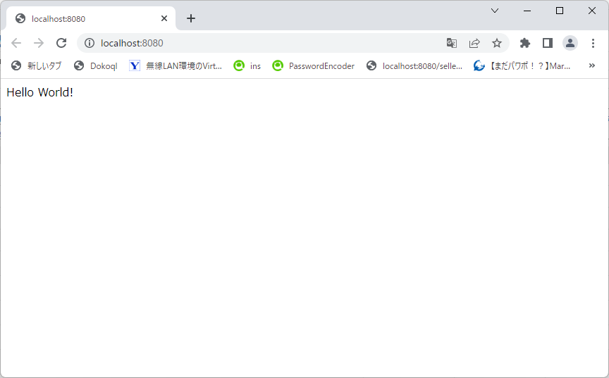  

コンソールのBean名にsampleControllerが増えています。  
`@Controller`を付与したことでBeanとしてインスタンスが作成されコンテナで管理されていることがわかります。
```
Let's inspect the beans provided by Spring Boot:
applicationAvailability
applicationTaskExecutor
....
routerFunctionMapping
sampleController
scheduledBeanLazyInitializationExcludeFilter
```

# Beanをインジェクションする
`com.example.demo.service.SampleService`を作成します。
```java
package com.example.demo.service;

import org.springframework.stereotype.Service;

@Service
public class SampleService {

    public String hello() {
        return "Hello Service!";
    }
}
```

`com.example.demo.controller.SampleController`を編集して`SampleService`をコンストラクタインジェクションします。
```diff
package com.example.demo.controller;

import org.springframework.http.HttpStatus;
import org.springframework.http.ResponseEntity;
import org.springframework.stereotype.Controller;
import org.springframework.web.bind.annotation.GetMapping;

import com.example.demo.service.SampleService;

@Controller
public class SampleController {

+   private final SampleService sampleService;
+
+   SampleController(SampleService sampleService) {
+       this.sampleService = sampleService;
+   }

    @GetMapping
    public ResponseEntity<String> get() {
        return new ResponseEntity<String>(sampleService.hello(), HttpStatus.OK);
    }
}

```

[http://localhost:8080/]()にアクセスして`SampleService`がインジェクションされていることを確認します。
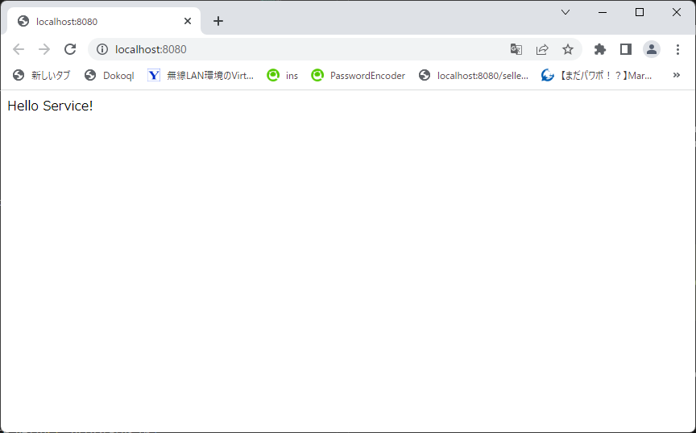  

Beanをインジェクションする方法は上記のコンストラクタインジェクションの他に以下の方法があります。  
### フィールドインジェクション(@Autowiredを付与)
```java
    @Autowired
    private SampleService sampleService;
```
### セッターインジェクション(Setterを作成)
```java
    private SampleService sampleService;

    @Autowired
    void setSampleService(SampleService sampleService) {
        this.sampleService = sampleService;
    }
```
>これらの方法はどれもBeanをインジェクションすることができますが、基本的にコンストラクタインジェクションを使うことが多いと思います。理由はコンストラクタを使ってインジェクションするとBeanの置き換え(Mock化等)が容易で、Beanの不変性も保たれるからです。

> 上記のインジェクション方法の他に「メソッドインジェクション」「ルックアップメソッドインジェクション」といった方法もあるが、今回は割愛。良く使うよという人がいれば教えて欲しい。。。


# Lombokを使用する

インジェクションする必要があるたびにコンストラクタを実装したり、修正したりするのは大変なので今回は`Lombok`を使ってコードの記述量を減らします。

`build.gradle`に追記します。
```diff
+configurations {
+ compileOnly {
+   extendsFrom annotationProcessor
+ }
+}

repositories {
  mavenCentral()
}

dependencies {
  implementation 'org.springframework.boot:spring-boot-starter'
+ compileOnly 'org.projectlombok:lombok'
  developmentOnly 'org.springframework.boot:spring-boot-devtools'
+ annotationProcessor 'org.projectlombok:lombok'
  testImplementation 'org.springframework.boot:spring-boot-starter-test'
}

```
`com.example.demo.controller.SampleController`に`@RequiredArgsConstructor`を追記してコンストラクタを自動生成します。
```diff
@Controller
+@RequiredArgsConstructor
public class SampleController {

    private final SampleService sampleService;

    @GetMapping
    public ResponseEntity<String> get() {
        return new ResponseEntity<String>(sampleService.hello(), HttpStatus.OK);
    }
}
```

# Controllerの戻り値をViewNameにする

Controllerのメソッド戻り値を`String`にしてリクエストクライアントにViewを戻します。  
今回のViewテクノロジーに`Thymeleaf`を使用します。

`build.gradle`に追記します。

```diff
dependencies {
    implementation 'org.springframework.boot:spring-boot-starter-web'
+   implementation 'org.springframework.boot:spring-boot-starter-thymeleaf'
    compileOnly 'org.projectlombok:lombok'
    developmentOnly 'org.springframework.boot:spring-boot-devtools'
    annotationProcessor 'org.projectlombok:lombok'
    testImplementation 'org.springframework.boot:spring-boot-starter-test'
}
```

`com.example.demo.controller.BookRegisterController`クラスを作成します。

```java
package com.example.demo.controller;

import org.springframework.stereotype.Controller;
import org.springframework.web.bind.annotation.GetMapping;
import org.springframework.web.bind.annotation.RequestMapping;

@Controller
@RequestMapping("/book/register")
public class BookRegisterController {

    @GetMapping
    public String form() {
        return "book/register";
    }
}
```

`src/main/resources`の配下に`templates/book/register.html`を作成します。

```html
<!DOCTYPE html>
<html xmlns:th="http://www.thymeleaf.org">
<meta charset="utf-8">
<title>蔵書を登録する</title>
<body>
    <div>
        <h1>蔵書を登録する</h1>
        <form action="/book/register">
            <div>
                <label for="bookName">蔵書名</label>
                <input type="text" name="bookName">
            </div>
            <div>
                <label for="isbn">ISBN</label>
                <input type="text" name="isbn">
            </div>
            <div>
                <label for="author">著者</label>
                <input type="text" name="author">
            </div>
            <div>
                <label for="description">蔵書の説明</label>
            <textarea name="description"></textarea>
            </div>
            <div>
                <label for="publisher">出版社</label>
                <input type="text" name="publisher">
            </div>
            <div>
                <label for="dateOfPublication">発行年月日</label>
                <input type="date" name="dateOfPublication">
            </div>
            <div>
                <input type="button" value="蔵書を登録する">
            </div>
        </form>
    </div>
</body>
</html>
```

[http://localhost:8080/book/register]()にアクセスして確認します。  
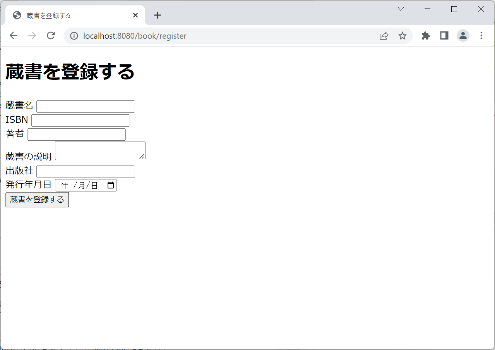  

# Controllerの呼び出しからView解決の流れ

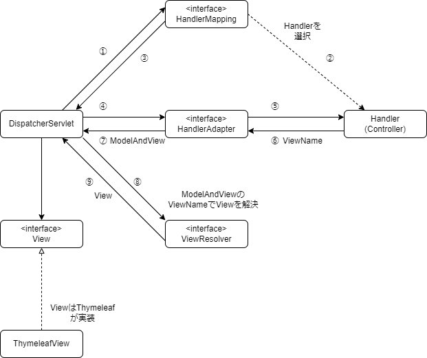

`Contoller`の戻り値は`ViewName`となり、`ViewResolver`によって対象の`View(今回はhtml)`を特定する。  
`register.html`へのパスはAutoConfigurationにより、`classpath:/templates/{ViewName}.html`となる。

`org.springframework.boot.autoconfigure.thymeleaf.ThymeleafProperties`にデフォルト値の設定。
```java
package org.springframework.boot.autoconfigure.thymeleaf;

...

@ConfigurationProperties(prefix = "spring.thymeleaf")
public class ThymeleafProperties {

	private static final Charset DEFAULT_ENCODING = StandardCharsets.UTF_8;

	public static final String DEFAULT_PREFIX = "classpath:/templates/";

	public static final String DEFAULT_SUFFIX = ".html";
```

# リクエストパラメータの受け取り

リクエストパラメータを受け取るために以下の通りclassやhtml等を追加、修正する。

```diff
<!DOCTYPE html>
<html xmlns:th="http://www.thymeleaf.org">
<meta charset="utf-8">
<title>蔵書を登録する</title>
<body>
    <div>
        <h1>蔵書を登録する</h1>
-       <form action="/book/register">
+       <form action="/book/register" th:action=@{/book/register} method="post" th:object="${bookRegister}">
            <div>
                <label for="bookName">蔵書名</label>
-               <input type="text" name="bookName">
+               <input type="text" th:field="*{bookName}">
            </div>
            <div>
                <label for="isbn">ISBN</label>
-               <input type="text" name="isbn">
+               <input type="text" th:field="*{isbn}">
            </div>
            <div>
                <label for="author">著者</label>
-               <input type="text" name="author">
+               <input type="text" th:field="*{author}">
            </div>
            <div>
                <label for="description">蔵書の説明</label>
-               <textarea name="description"></textarea>
+               <textarea th:field="*{description}"></textarea>
            </div>
            <div>
                <label for="publisher">出版社</label>
-               <input type="text" name="publisher">
+               <input type="text" th:field="*{publisher}">
            </div>
            <div>
                <label for="dateOfPublication">発行年月日</label>
-               <input type="date" name="dateOfPublication">
+               <input type="date" th:field="*{dateOfPublication}">
            </div>
            <div>
-               <input type="button" value="蔵書を登録する">
+               <input type="submit" value="蔵書を登録する">
            </div>
        </form>
    </div>
</body>
</html>
```

`com.example.demo.model.BookRegister`を追加。

```java
package com.example.demo.model;

import java.time.LocalDate;

import lombok.AllArgsConstructor;
import lombok.Getter;
import lombok.ToString;

@Getter
@ToString
@AllArgsConstructor
public class BookRegister {

    private String bookName;

    private String isbn;

    private String author;

    private String description;

    private String publisher;

    @DateTimeFormat(iso = DateTimeFormat.ISO.DATE)
    private LocalDate dateOfPublication;

}


```

`com.example.demo.controller.BookRegisterController`
```diff
package com.example.demo.controller;

import org.springframework.stereotype.Controller;
import org.springframework.web.bind.annotation.GetMapping;
+ import org.springframework.web.bind.annotation.ModelAttribute;
+ import org.springframework.web.bind.annotation.PostMapping;
import org.springframework.web.bind.annotation.RequestMapping;

+ import com.example.demo.model.BookRegister;

@Controller
@RequestMapping("/book/register")
public class BookRegisterController {

    @GetMapping
-   public String form() {
+   public String form(@ModelAttribute BookRegister bookRegister) {
        return "book/register";
    }

+   @PostMapping
+   public String submit(@ModelAttribute BookRegister bookRegister) {
+       System.out.println(bookRegister);
+       return "book/register";
+   }
}

```

以下の画面の通り、フォームを入力して`蔵書を登録する`ボタンをクリック。  

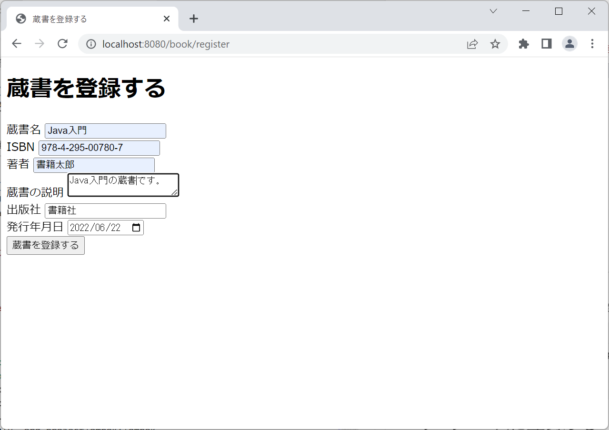  
  
コンソールを確認すると`System.out.println(bookRegister);`によってリクエストパラメータが受け取れていることが確認できます。
```
BookRegister(bookName=Java入門, isbn=978-4-295-00780-7, author=蔵書太郎, description=Java入門の蔵書です。, publisher=蔵書社, dateOfPublication=2022-06-22)
```

# データベースに登録する

今回はO/Rマッパーに`Spring Data`を使って登録します。

`build.gradle`に追記します。

```diff
dependencies {
+   implementation 'org.springframework.boot:spring-boot-starter-data-jpa'
    implementation 'org.springframework.boot:spring-boot-starter-web'
    implementation 'org.springframework.boot:spring-boot-starter-thymeleaf'
    compileOnly 'org.projectlombok:lombok'
    developmentOnly 'org.springframework.boot:spring-boot-devtools'
    annotationProcessor 'org.projectlombok:lombok'
    testImplementation 'org.springframework.boot:spring-boot-starter-test'
}
```

データベースとテーブルを作成します。
```sql
-- データベース作成
create database library default character set utf8mb4;

-- 蔵書テーブル
create table book (
    isbn varchar(17) primary key,
    book_name varchar(512) not null,
    author varchar(512) not null,
    description text not null,
    publisher varchar(512) not null,
    date_of_publication date not null
);
```
Entityはリレーショナルデータベースのレコードを表します。
`com.example.demo.entity.Book`
```java
package com.example.demo.entity;

import java.time.LocalDate;

import javax.persistence.Entity;
import javax.persistence.Id;

import lombok.AllArgsConstructor;
import lombok.Getter;
import lombok.NoArgsConstructor;
import lombok.ToString;

@Entity
@Getter
@ToString
@NoArgsConstructor
@AllArgsConstructor
public class Book {

    @Id
    private String isbn;

    private String bookName;

    private String author;

    private String description;

    private String publisher;

    private LocalDate dateOfPublication;
}
```

データアクセス
`com.example.demo.repository.BookRepository`
```java
package com.example.demo.repository;

import org.springframework.data.repository.CrudRepository;
import org.springframework.stereotype.Repository;

import com.example.demo.entity.Book;

@Repository
public interface BookRepository extends CrudRepository<Book, String>{

}
```

今回`BookRegister`を使った`Book`の生成はConverterを使ってみます。  
`Converter`を実装して`@Component`でBeanとします。
```java
package com.example.demo.converter;

import org.springframework.core.convert.converter.Converter;
import org.springframework.stereotype.Component;

import com.example.demo.entity.Book;
import com.example.demo.model.BookRegister;

@Component
public class BookConverter implements Converter<BookRegister, Book>{

    @Override
    public Book convert(BookRegister source) {
        return new Book(
                source.getIsbn(),
                source.getBookName(),
                source.getAuthor(),
                source.getDescription(),
                source.getPublisher(),
                source.getDateOfPublication());
    }

}
```

`com.example.demo.service.BookRegisterService`
```java
package com.example.demo.service;

import org.springframework.core.convert.ConversionService;
import org.springframework.stereotype.Service;

import com.example.demo.entity.Book;
import com.example.demo.model.BookRegister;
import com.example.demo.repository.BookRepository;

import lombok.RequiredArgsConstructor;

@Service
@RequiredArgsConstructor
public class BookRegisterService {

    private final ConversionService conversionService;
    
    private final BookRepository bookRepository;

    public void doService(BookRegister bookRegister) {
        Book book = conversionService.convert(bookRegister, Book.class);
        bookRepository.save(book);
    }
}
```

`com.example.demo.controller.BookRegisterController`
```diff
@Controller
@RequestMapping("/book/register")
+@RequiredArgsConstructor
public class BookRegisterController {

+   private final BookRegisterService bookRegisterService;

    @GetMapping
    public String form(@ModelAttribute BookRegister bookRegister) {
        return "book/register";
    }

    @PostMapping
    public String submit(@ModelAttribute BookRegister bookRegister) {
        System.out.println(bookRegister);
+       bookRegisterService.doService(bookRegister);
        return "book/register";
    }
}
```

データアクセスするための設定を`application.yml`に追記します。
```yml
spring:
    datasource:
        url: jdbc:mysql://localhost:53306/library
        username: root
        password: root
        driver-class-name: com.mysql.cj.jdbc.Driver
    jpa:
        properties:
            hibernate:
                dialect: org.hibernate.dialect.MySQL8Dialect
```
`蔵書を登録する`をクリックして、実際に登録してみます。

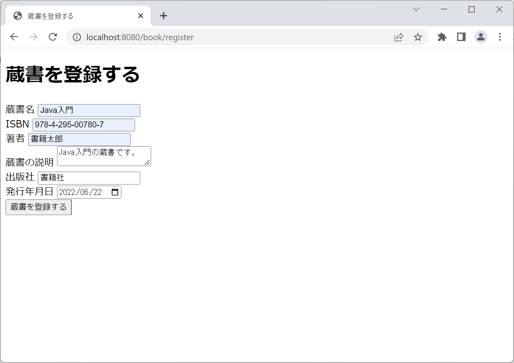  

`book`テーブルに登録できました。
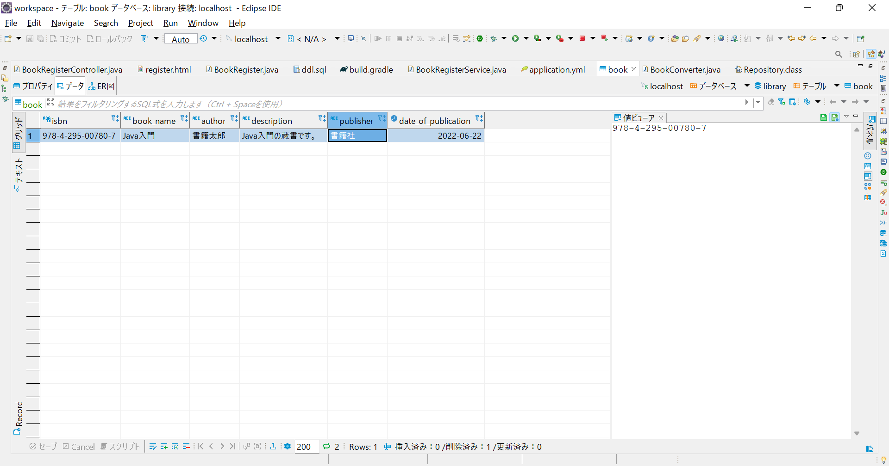  

# 入力データのバリデーション

データの整合性、入力要件を満たすために入力データのバリデーションを実装します。

`build.gradle`
```diff
dependencies {
+   implementation 'org.springframework.boot:spring-boot-starter-validation'
    implementation 'org.springframework.boot:spring-boot-starter-data-jpa'
    implementation 'org.springframework.boot:spring-boot-starter-web'
    implementation 'org.springframework.boot:spring-boot-starter-thymeleaf'
    compileOnly 'org.projectlombok:lombok'
    developmentOnly 'org.springframework.boot:spring-boot-devtools'
    runtimeOnly 'mysql:mysql-connector-java'
    annotationProcessor 'org.projectlombok:lombok'
    testImplementation 'org.springframework.boot:spring-boot-starter-test'
}
```

アノテーションでバリデーションの内容を定義します。
`com.example.demo.model.BookRegister`
```diff
@Getter
@ToString
@AllArgsConstructor
public class BookRegister {

+   @NotEmpty(message = "蔵書名を入力してください")
+   @Size(max = 100, message = "蔵書は100文字以内で入力してください")
    private String bookName;

+   @NotEmpty(message = "ISBNを入力してください")
+   @Size(max = 13, message = "ISBNはハイフンを含めて17文字で入力してください")
+   @Pattern(regexp = "(978|979)-[0-9]{1,5}-[0-9]{1,5}-[0-9]", message = "ISBNの規格に則っていません")
    private String isbn;

+   @NotEmpty(message =  "著者を入力してください")
+   @Size(max = 100, message = "著者は100文字以内で入力してください")
    private String author;

+   @NotEmpty(message = "蔵書の説明を入力してください")
+   @Size(max = 1000, message = "蔵書の説明は1000文字以内で入力してください")
    private String description;

+   @NotEmpty(message = "出版者を入力してください")
+   @Size(max = 100, message = "出版社は100文字以内で入力してください")
    private String publisher;

+   @NotNull(message = "発行年月日を入力してください")
    @DateTimeFormat(iso = DateTimeFormat.ISO.DATE)
    private LocalDate dateOfPublication;

}
```
バリデーションの結果でエラーがある場合、登録サービスが実行されないようにします。
`com.example.demo.controller.BookRegisterController`
```diff
    @PostMapping
-   public String submit(@ModelAttribute BookRegister bookRegister) {
+   public String submit(@Validated @ModelAttribute BookRegister bookRegister, BindingResult bindingResult) {
        
+       if (bindingResult.hasErrors()) {
+           return "book/register";
+       }

        System.out.println(bookRegister);
        bookRegisterService.doService(bookRegister);
        return "book/register";
    }
```

エラーメッセージが表示されるようにします。
`book/register.html`
```diff
<h1>蔵書を登録する</h1>
<form action="/book/register" th:action=@{/book/register} method="post" th:object="${bookRegister}">
+           <ul th:if="${#fields.hasErrors('*')}">
+               <li th:each="err : ${#fields.errors('*')}" th:text="${err}">
+           </ul>
```
入力フォームに何も入力せずに`蔵書を登録する`をクリックすると、エラーメッセージが表示されました。
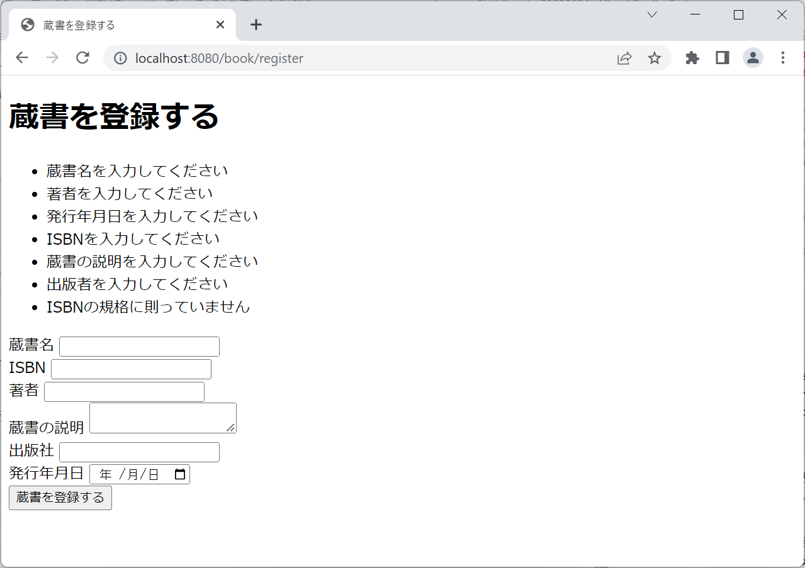  

エラーメッセージを協調するため、画面を装飾します。

