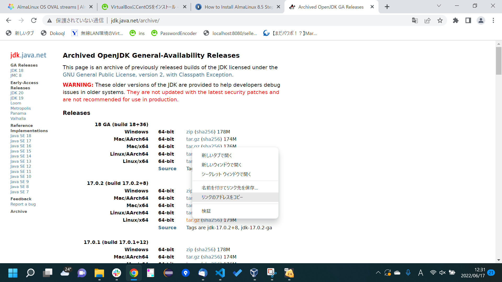

# LinuxにJDKをダウンロードする

1. AlmaLinuxサーバにログインして、以下のコマンドで`wget`をインストール。  
  `yum -y install wget`

1. [http://jdk.java.net/archive/]()にアクセス。今回は`17.0.2 (build 17.0.2+8)`の`Linux/x64`のtar.gzのアドレスをコピー
  

1. 以下のコマンドでダウンロードする。  
`wget https://download.java.net/java/GA/jdk17.0.2/dfd4a8d0985749f896bed50d7138ee7f/8/GPL/openjdk-17.0.2_linux-x64_bin.tar.gz`

1. tar.gzを展開する。  
`tar -zxvf openjdk-18_linux-x64_bin.tar.gz`

1. 環境変数を設定します。以下のコマンドを実行。  
`vi ~/.bashrc`

1. 以下の通り内容を書き換える。
    ```
    # .bash_profile

    # Get the aliases and functions
    if [ -f ~/.bashrc ]; then
            . ~/.bashrc
    fi

    # User specific environment and startup programs
    JAVA_HOME=/root/jdk-17.0.2
    PATH=$PATH:$HOME/bin:$JAVA_HOME/bin

    export PATH
    export JAVA_HOME
    ```

1. 以下のコマンドで環境変数を読み込み。  
  `source ~/.bash_profile`

1. `java -version`が実行できること確認。

    ```
      [root@localhost jdk-17.0.2]# java -version
      openjdk version "17.0.2" 2022-01-18
      OpenJDK Runtime Environment (build 17.0.2+8-86)
      OpenJDK 64-Bit Server VM (build 17.0.2+8-86, mixed mode, sharing)
      [root@localhost jdk-17.0.2]#
    ```
以上