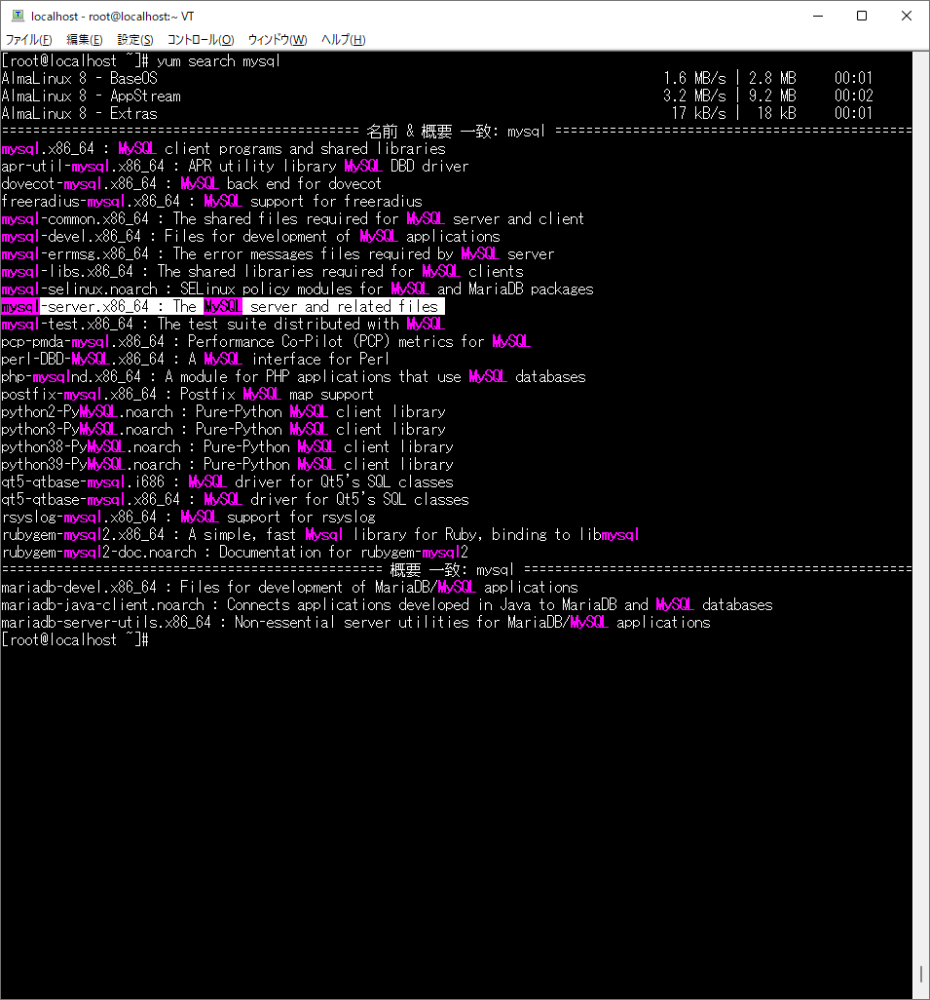
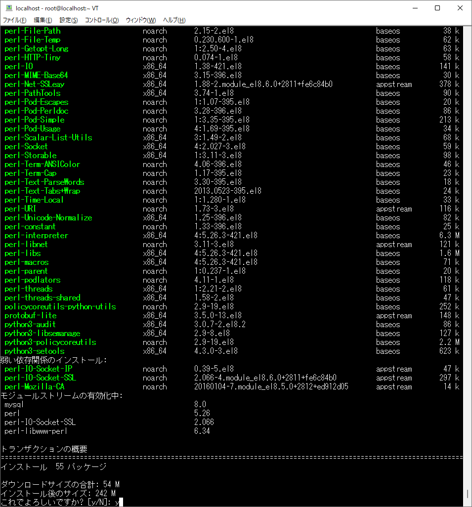
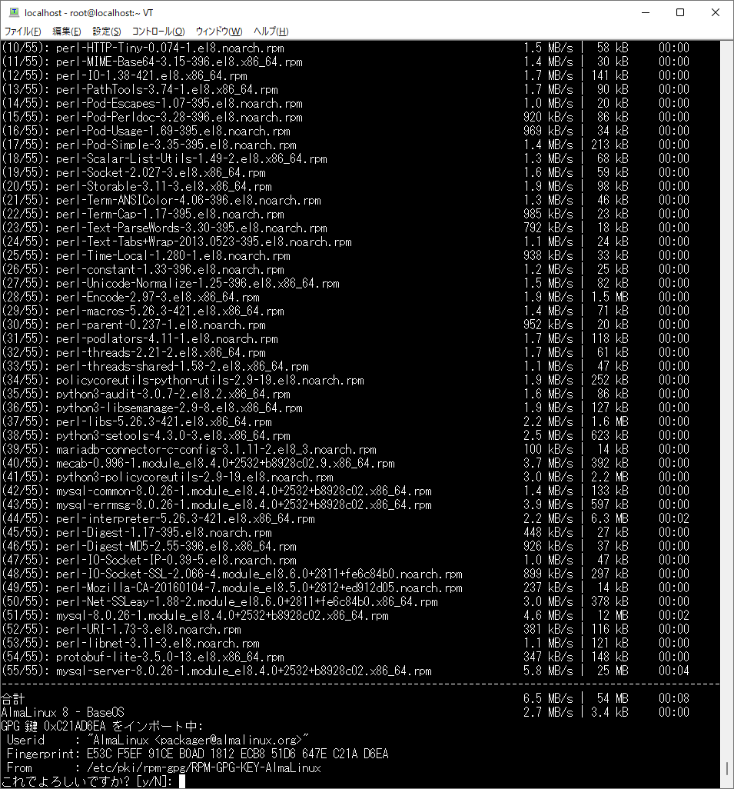
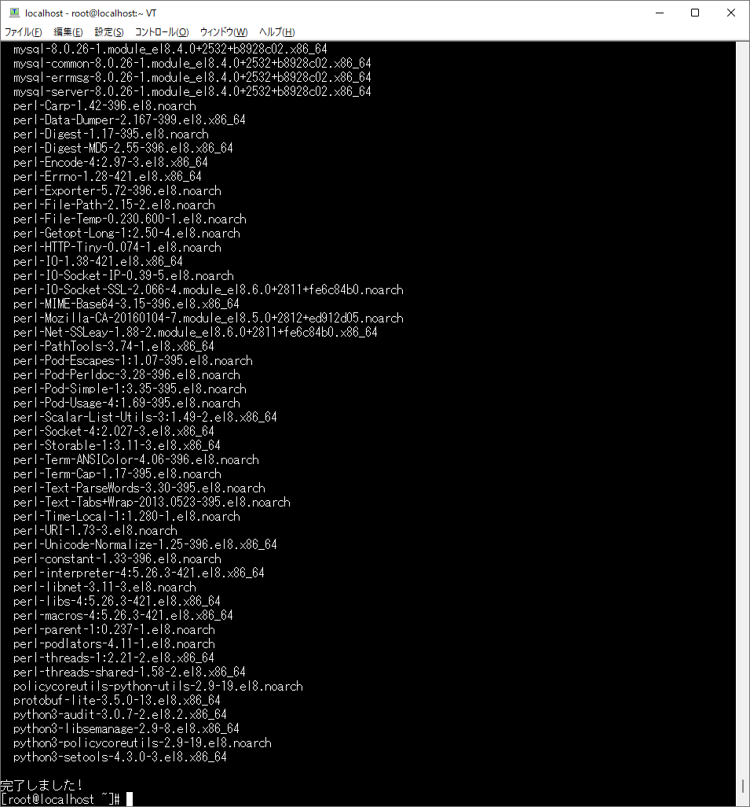
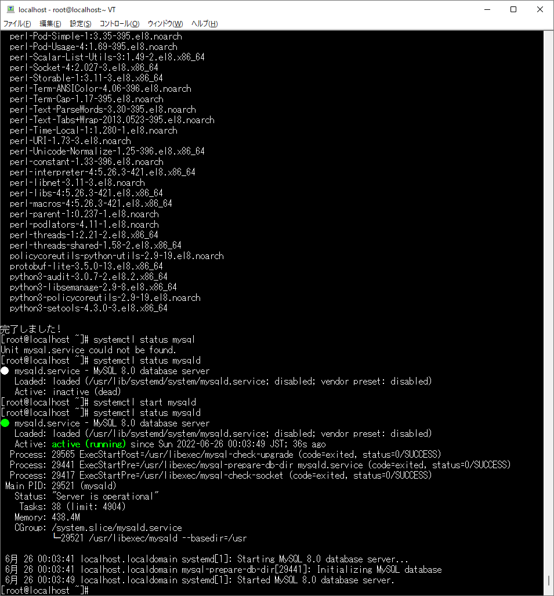
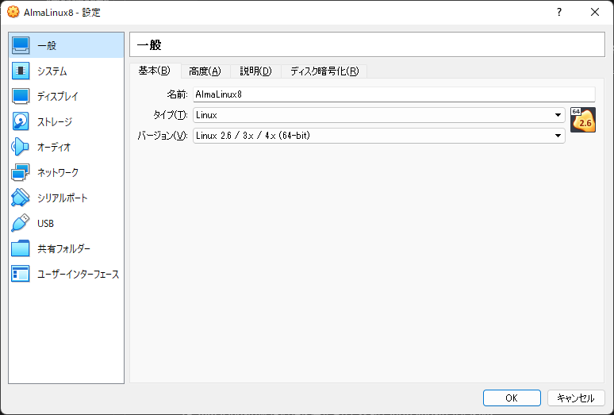
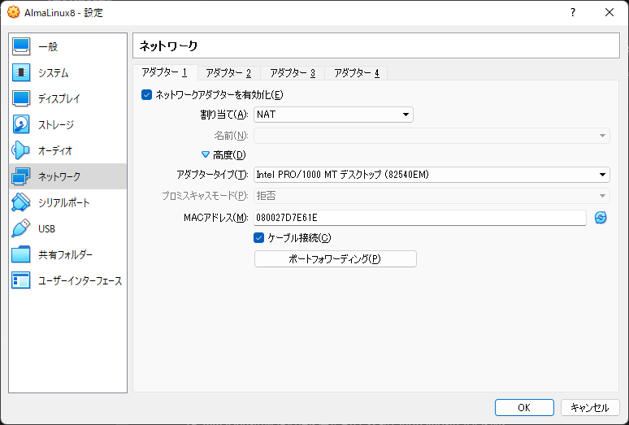
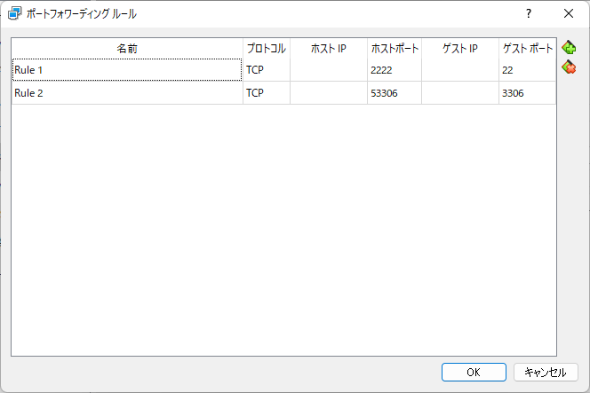
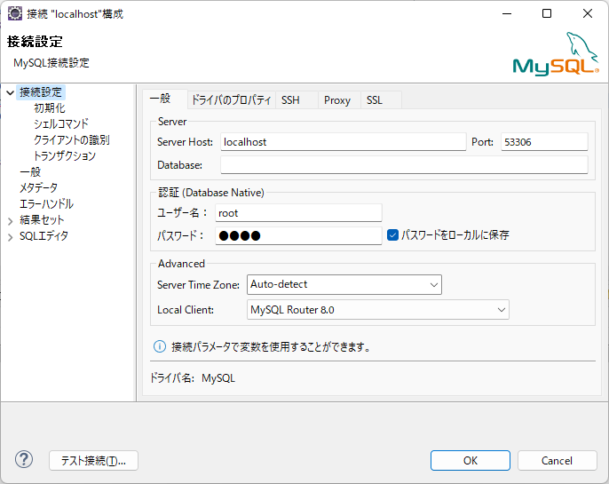
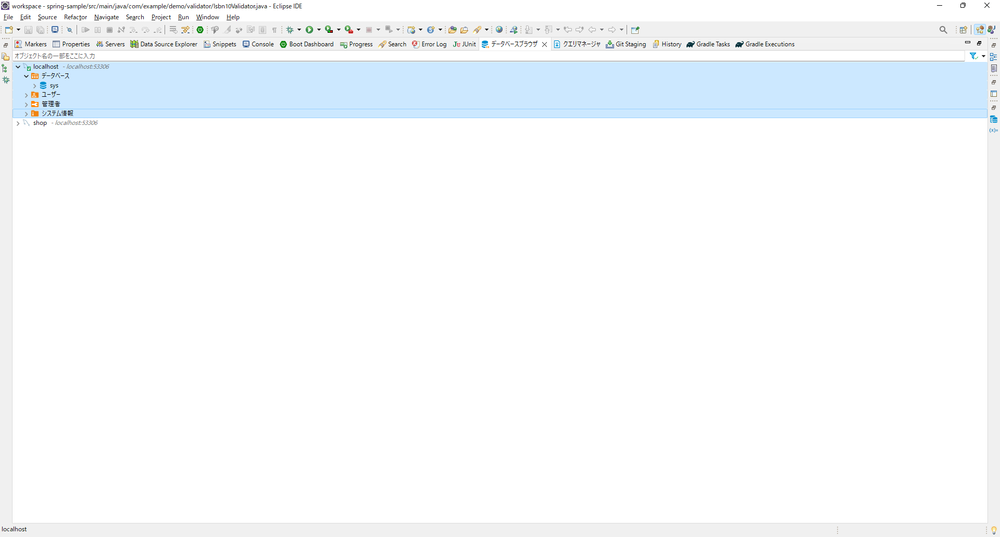

# AlmaLinuxにMySQLをインストールする手順

1. VirtualBoxのコンソールや、Teraterm等でログイン。  
  

1. コマンド`yum search mysql`を実行。`mysql-server.x86_64`をインストールします。  
  

1. コマンド`yum install mysql-server.x86_64`を実行。`これでよろしいですか?`が表示されたら`y`を入力してEnter。  
  

1. これも`y`を入力してEnter。  
  

1. インストール完了を確認。  
  

1. `systemctl start mysqld`でMySQLを起動。  

1. `systemctl status mysqld`で起動状態を確認。  
  

1. コマンド`mysql -u root`を実行してログインできるか確認。

1. `alter user'root'@'localhost' identified by '{パスワード}';`を実行してパスワードを設定。

1. 一旦MySQLからログアウト。コマンド`mysql -u root -p`を実行してパスワード付きでログインできるか確認。

1. `create user '{ユーザ名}'@'10.0.2.2' identified by '{パスワード}';`を実行。

1. `grant all privileges on *.* to 'root'@'10.0.2.2';`を実行して権限を付与。

1. `show grants for 'root'@'10.0.2.2';`を実行して権限を確認。
    ```
    mysql> show grants for 'root'@'10.0.2.2';
    +----------------------------------------------------------------------------------------------------------------------------------------------------------------------------------------------------------------------------------------------------------------------------------------------------------------------------------------------------------------------------------------------------------------------------------------------------------------------------------------------------------------------------------------------------------------------------------------------------------+
    | Grants for root@10.0.2.2                                                                                                                                                                                                                                                                                                                                                                                                                                                                                                                                                                                 |
    +----------------------------------------------------------------------------------------------------------------------------------------------------------------------------------------------------------------------------------------------------------------------------------------------------------------------------------------------------------------------------------------------------------------------------------------------------------------------------------------------------------------------------------------------------------------------------------------------------------+
    | GRANT SELECT, INSERT, UPDATE, DELETE, CREATE, DROP, RELOAD, SHUTDOWN, PROCESS, FILE, REFERENCES, INDEX, ALTER, SHOW DATABASES, SUPER, CREATE TEMPORARY TABLES, LOCK TABLES, EXECUTE, REPLICATION SLAVE, REPLICATION CLIENT, CREATE VIEW, SHOW VIEW, CREATE ROUTINE, ALTER ROUTINE, CREATE USER, EVENT, TRIGGER, CREATE TABLESPACE, CREATE ROLE, DROP ROLE ON *.* TO `root`@`10.0.2.2`                                                                                                                                                                                                                    |
    | GRANT APPLICATION_PASSWORD_ADMIN,AUDIT_ADMIN,BACKUP_ADMIN,BINLOG_ADMIN,BINLOG_ENCRYPTION_ADMIN,CLONE_ADMIN,CONNECTION_ADMIN,ENCRYPTION_KEY_ADMIN,FLUSH_OPTIMIZER_COSTS,FLUSH_STATUS,FLUSH_TABLES,FLUSH_USER_RESOURCES,GROUP_REPLICATION_ADMIN,INNODB_REDO_LOG_ARCHIVE,INNODB_REDO_LOG_ENABLE,PERSIST_RO_VARIABLES_ADMIN,REPLICATION_APPLIER,REPLICATION_SLAVE_ADMIN,RESOURCE_GROUP_ADMIN,RESOURCE_GROUP_USER,ROLE_ADMIN,SERVICE_CONNECTION_ADMIN,SESSION_VARIABLES_ADMIN,SET_USER_ID,SHOW_ROUTINE,SYSTEM_USER,SYSTEM_VARIABLES_ADMIN,TABLE_ENCRYPTION_ADMIN,XA_RECOVER_ADMIN ON *.* TO `root`@`10.0.2.2` |
    +----------------------------------------------------------------------------------------------------------------------------------------------------------------------------------------------------------------------------------------------------------------------------------------------------------------------------------------------------------------------------------------------------------------------------------------------------------------------------------------------------------------------------------------------------------------------------------------------------------+
    2 rows in set (0.00 sec)
    ```
1. MySQLからログアウトしてファイヤーウォールの設定を変更します。

1. コマンド`systemctl status firewalld`を実行して、ファイヤーウォールが`active`であることを確認。

1. コマンド`firewall-cmd --add-port=3306/tcp --zone=public --permanent`を実行。ポート3306を追加。

1. コマンド`firewall-cmd --list-all`を実行。設定状態を確認。
    ```
    [root@localhost ~]# firewall-cmd --list-all
    public (active)
    target: default
    icmp-block-inversion: no
    interfaces: enp0s3
    sources:
    services: cockpit dhcpv6-client ssh
    ports: 3306/tcp
    protocols:
    forward: no
    masquerade: no
    forward-ports:
    source-ports:
    icmp-blocks:
    rich rules:
    ```

1. コマンド`firewall-cmd --reload`で設定を有効化。

1. AlmaLinuxの仮想環境を停止させた状態でVirtualBoxの設定を開く。
  


1. 左側のネットワークを選択。高度をクリックしてポートフォワーディングをクリック。
  

1. ホストOSからゲストOSのMySQLに接続するための、ポートフォワーディングルールを設定する。
    + 名前：任意
    + プロトコル：TCP
    + ホストポート：任意（空いているポート）
    + ゲストポート：3306
  

1. ホストからデータベースクライアントを使って接続。下の図はDBeaver(Eclipseプラグイン)から接続。
  
  
