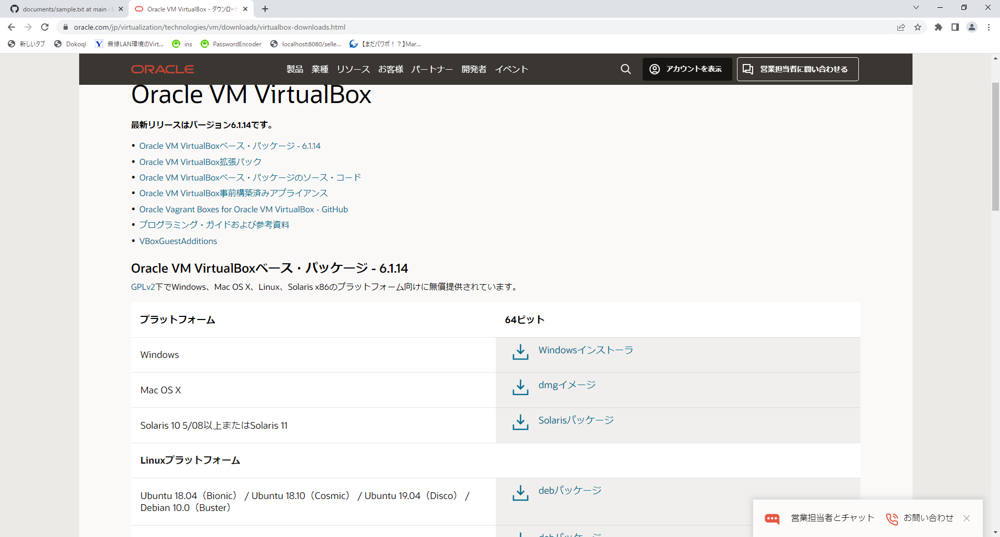
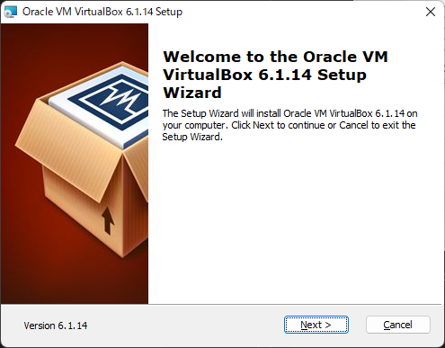
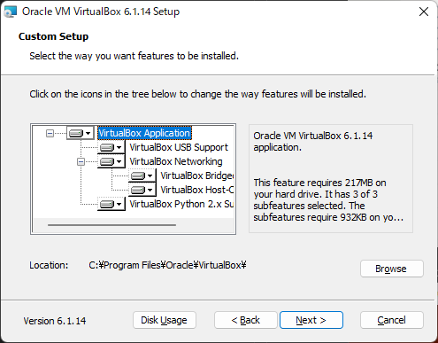
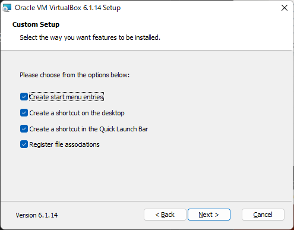
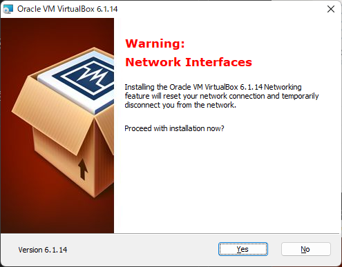
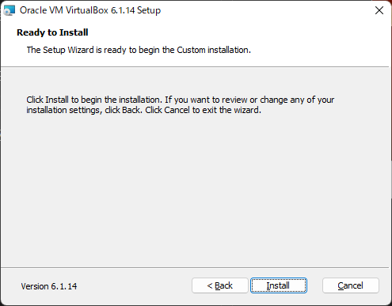
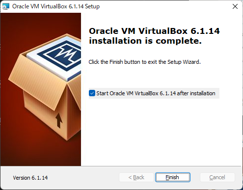

# VirtualBox インストール手順

1. [ダウンロードサイト](https://www.oracle.com/jp/virtualization/technologies/vm/downloads/virtualbox-downloads.html)にアクセスする。

1. Windowsインストーラをクリックして、インストーラをダウンロード。
  

1. ダウンロード完了後、インストーラを実行。Nextをクリック。  
  

1. Nextをクリック。  
  

1. Nextをクリック。  
  

1. Yesをクリック。  
  

1. Installをクリック。   
  

1. Finishをクリック。  
  

VirtualBoxのインストールは以上です。