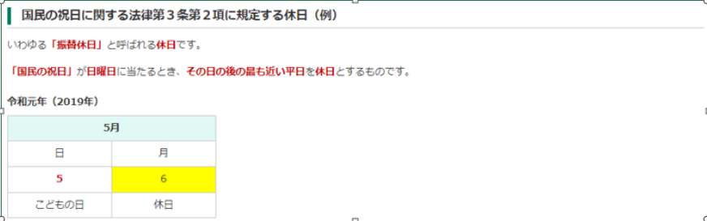
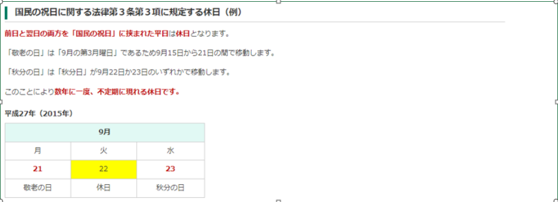

# 課題1

+ プロンプトにカレンダーを出力するプログラムを作成する。  

+ 年(N)と月(M)を標準入力から取得して年月に応じたカレンダーを標準出力に出力すること。  
+ 当プログラムが対応する入力データの範囲は以下の通り。  
    1950 ≦ N ≦ 2999
    1 ≦ M ≦ 12
+ もし範囲外の入力が与えられた場合は以下の文字列を出力する。  
    `不正な入力です。カレンダーを出力できません。`

+ 入力は標準入力から以下の形式で与えられる。  
`N M`

+ 入力例  
`2022 11`

+ 出力例  
    ```
    |------------------------------------------------|
    |                                                |
    |                 2022月11月                     |
    |                                                |
    |------|------|------|------|------|------|------|
    |  日  |  月  |  火  |  水  |  木  |  金  |  土  |
    |------|------|------|------|------|------|------|
    | 10/30|  31  | 11/1 |  2   |  3   |  4   |  5   |
    |------|------|------|------|------|------|------|
    |  6   |  7   |  8   |  9   |  10  |  11  |  12  |
    |------|------|------|------|------|------|------|
    |  13  |  14  |  15  |  16  |  17  |  18  |  19  |
    |------|------|------|------|------|------|------|
    |  20  |  21  |  22  |  23  |  24  |  25  |  26  |
    |------|------|------|------|------|------|------|
    |  27  |  28  |  29  |  30  | 12/1 |  2   |  3   |
    |------|------|------|------|------|------|------|
    ```

# 課題2

+ 休日CSVファイルを読み込んで平日、休日判定するプログラムを作成する。

+ 入力から与えられた日付が平日の場合、「平日」と出力する。
+ 入力から与えられた日付が土曜日、日曜日、祝日の場合、「休日」と出力する。
+ 日付文字列の形式はYYYY-MM-DDとして、例えば2022年1月1日の入力の場合、「2022-01-01」の文字列が与えられる。

+ 以下のリンク（内閣府HP）からCSVファイルをダウンロードして、このファイルをプログラムで読み込むこと。
+ そしてファイルに記載がある日付を祝日とする。  
    https://www8.cao.go.jp/chosei/shukujitsu/syukujitsu.csv

+ また以下のような法律により規定された休日も「休日」と出力する。

    その1  
      

    その2  
      

1. 入力例  
    `2022-11-14`  
    出力例  
    `平日`  

<br>

1. 入力例（日曜日）  
    `2022-11-13`  
    出力例  
    `休日`  

<br>

3. 入力例（土曜日）  
    `2022-11-12`  
    出力例  
    `休日`  

<br>

4. 入力例（祝日）  
    `2015-09-21`  
    出力例  
    `休日`  

<br>

5. 入力例（振替休日）  
    `2019-05-06`  
    出力例  
    `休日`

<br>

6. 入力例（国民の祝日に挟まれた平日）  
    `2019-09-22`  
    出力例  
    `休日`  

# 課題3

+ 天気予報のAPIを使用して日付ごとの天気を出力する。

+ 使用する天気予報API  
    [open-meteo](https://open-meteo.com/en)
+ 天気予報APIのレスポンスボディ(Json)をパースするためにライブラリを使用してもよい。  
    例：[Jakarta JSON Processing API](https://mvnrepository.com/artifact/jakarta.json/jakarta.json-api)

+ `weathercode`は以下の通り変換して表示する。

    | weathercode | 変換後の天気名 |
    | ---- | ---- |
    | 0 ~ 1 | 晴れ |
    | 2 ~ 3 | 曇り |
    | 45 ~ 67 | 雨 |
    | 71 ~ 86 | 雪 |
    | 95 ~ 99 | 雷雨 |

+ 入力として日付の文字列が与えられ、天気予報APIを使用して日付と天気を出力する。

    入力例  
    `2022-11-11`  
    出力例  
    `2022-11-11 晴れ`  

+ 日付の文字列として有効な形式は以下の通り。
    + 2022-01-01
    + 2022-1-1
    + 2022年1月1日
    + 2022/01/01
    + 2022/1/1
    + Jan 1 2022
    + January 1 2022
    > 英語による月の文字列は大文字小文字は問わない。ただし半角であること。

    出力例（上記の入力は全て以下のように出力する）  
    `2022-01-01 晴れ`

+ 入力として日付の文字列と数値Nが与えられた場合、その日付を含めてN日分の天気を出力する。
+ 数値Nの範囲は、1≦N≦7とする。

    入力例  
    `2022-11-11 4`  

    出力例  
    `2022-11-11 晴れ`  
    `2022-11-12 曇り`  
    `2022-11-13 雨`  
    `2022-11-14 雪`  

+ 以下のように入力から2つの日付の文字列が与えられた場合、開始日付から終了日付までの天気予報を出力する。

    入力例  
    `2022-11-11 2022-11-13`  

    出力例  
    `2022-11-11 晴れ`  
    `2022-11-12 曇り`  
    `2022-11-13 雨`  
    
